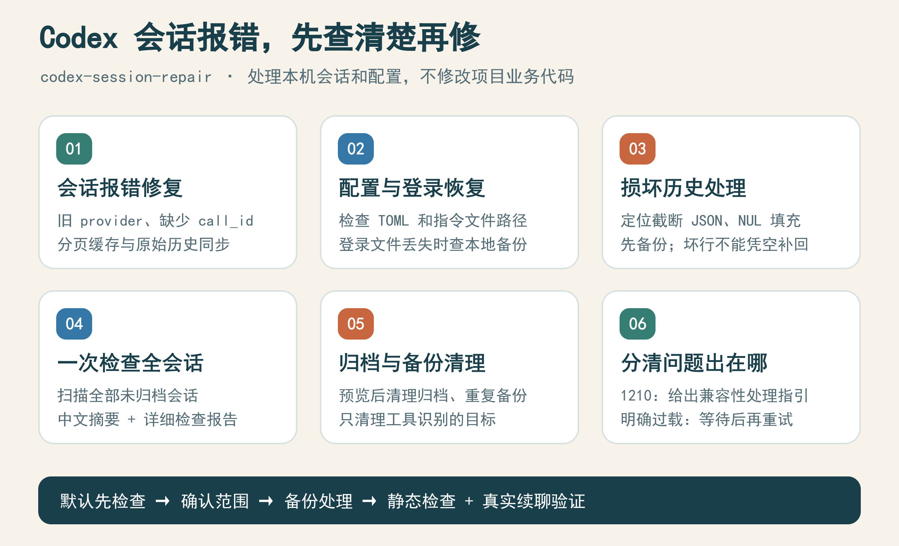
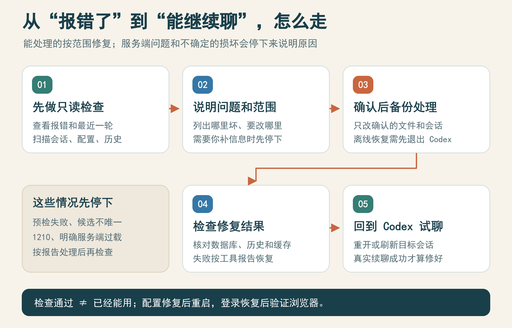
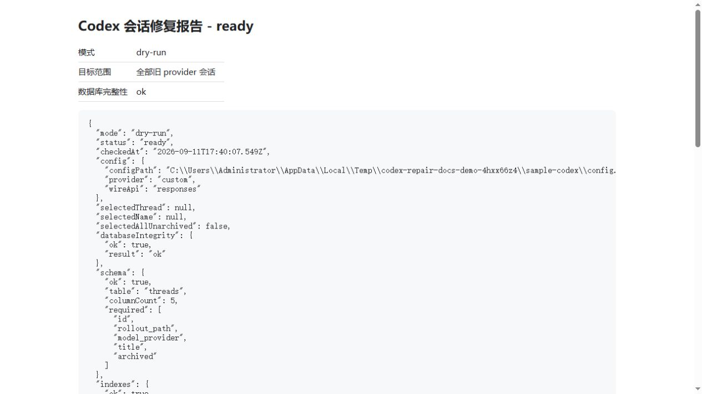
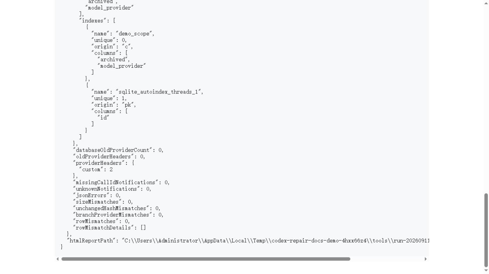
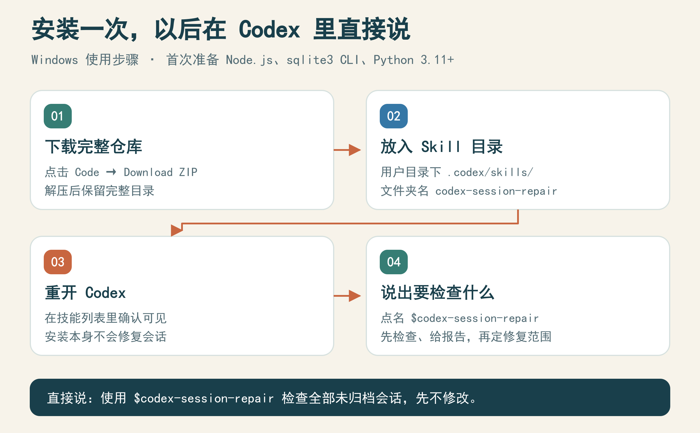

# Codex 修复会话报错

Version: `1.10.0`

**Codex 里的旧会话突然报错、继续聊不下去时，用它先查原因，再按确认的范围备份、修复和验证。**

它处理的是本机 Codex 的会话记录、配置和备份，不修改你项目里的业务代码。安装 Skill 只是装好工具，不会自动修复或删除会话。

<p align="center">
  
</p>

[下载完整仓库](https://github.com/ssqaq/codex-session-repair/archive/refs/heads/master.zip) · [安装和调用](#安装和调用) · [修复流程](#一张图看懂修复流程) · [真实报告截图](#真实报告长什么样) · [详细恢复指南](references/local-recovery.md)

## 它能帮你解决什么

| 序号 | 你遇到的情况 | 它会怎么处理 |
| --- | --- | --- |
| 1 | 旧会话出现 `codex_local_access`、缺少 `call_id` | 检查旧 provider 和已识别的心跳、跨会话通知；确认后备份修复，需要时同步分页缓存 |
| 2 | 创建聊天报 `os error 123`、模型指令文件读不到 | 检查 `model_instructions_file` 路径，找到唯一可用文件后修正；修完需重启 Codex |
| 3 | `config.toml` 报语法错误或项目路径转义错误 | 检查整个 TOML；明确正确路径和行号后，只改目标行，再解析验证 |
| 4 | 浏览器提示 `auth token is unavailable` | 查登录文件是否丢失；有唯一可用本地备份时恢复，不覆盖已有登录文件 |
| 5 | 历史文件报截断 JSON，或有 NUL 填充 | 逐文件定位；备份后处理填充。截断坏行经授权可隔离，不能补回已经丢失的原文 |
| 6 | 想知道哪些会话有问题 | 一条命令扫描全部未归档会话，输出中文短报告，并检查配置、归档和重复备份 |
| 7 | 归档会话和旧备份太多 | 先列出范围，再清理指定类型；归档删除有备份，重复备份清理保留最新完整副本 |
| 8 | 检查通过了，但 `previous_response_id` 仍报错 | 诊断最近一轮，指导刷新或重启；必要时从已完成历史分出新任务，再实际试聊 |
| 9 | `1210`、内容类型不兼容、服务端过载 | 识别原因并给处理指引；不会自动改中转站，也不会把所有断线都当成过载 |

登录恢复有条件：已有登录文件、过期凭据、找不到可用备份的 `plugin 401`，仍需手动处理。恢复本地文件不代表在线登录已经成功。

## 一张图看懂修复流程

<p align="center">
  
</p>

1. **先检查**：说清楚哪个会话、什么报错，让工具先出报告。
2. **看处理范围**：它会说明要改哪些文件、哪些问题还需要补信息。
3. **确认后再处理**：先备份，再修复。登录、TOML 和损坏历史的离线恢复，需要先退出 Codex，在外部终端执行。
4. **检查文件和数据**：核对数据库、历史记录，必要时同步分页缓存。
5. **回到 Codex 试用**：能真实续聊才算会话修好了；登录恢复则需要再验证浏览器是否能用。

## 真实报告长什么样

以下两张是 **`v1.10.0` 原有脚本实际生成的 HTML 报告截图**。数据来自两条独立的示例会话，不是用户的真实聊天；报告页面没有重画，也不是虚构的操作界面。

<table>
  <tr>
    <td width="50%" valign="top"><strong>1. 修复前：先检查，尚未改数据</strong><br></td>
    <td width="50%" valign="top"><strong>2. 修复后：查看验证结果</strong><br></td>
  </tr>
</table>

| 序号 | 报告里的词 | 大白话意思 |
| --- | --- | --- |
| 1 | `dry-run` / `ready` | 只做了检查，已具备继续处理的条件，还没修复 |
| 2 | `apply` / `complete` | 本次脚本修复已完成；这不代表已经验证真实续聊 |
| 3 | `databaseOldProviderCount: 0` | 验证统计中没有残留的旧 provider |
| 4 | `missingCallIdNotifications: 0` | 验证范围内，缺少 `call_id` 的通知已没有残留 |
| 5 | `jsonErrors: 0`、`sizeMismatches: 0` | JSON 检查通过，文件大小没有异常变化 |

示例实测：修复前有 2 个旧 provider 会话、2 条缺少 `call_id` 的通知；修复后对应残留为 0。它证明了示例数据上的脚本行为，不代表你的会话也已修复。[查看图片来源和复现方法](docs/images/README.md)。点击图片可以放大。

## 安装和调用

<p align="center">
  
</p>

下面按 Windows 说明。当前脚本需要 **Node.js、sqlite3 命令行工具和 Python 3.11+**；不是下载一个 exe 后双击运行的独立软件。

1. [下载完整 ZIP](https://github.com/ssqaq/codex-session-repair/archive/refs/heads/master.zip)，解压后把文件夹改名为 `codex-session-repair`。
2. 将整个文件夹放到 `%USERPROFILE%\.codex\skills\`。最终应能找到 `%USERPROFILE%\.codex\skills\codex-session-repair\SKILL.md`，同一层还要有 `scripts`、`references` 和 `agents`，不要只复制一个 `SKILL.md`。已有同名安装时，先保留原目录副本，再替换工具文件。
3. 在 PowerShell 中运行 `node --version`、`sqlite3 --version`、`python --version`，确认三个命令都能找到，Python 不低于 3.11。Node.js 可从 [官网](https://nodejs.org/) 下载，sqlite3 使用 [官方命令行工具包](https://www.sqlite.org/download.html)，Python 使用 [官方安装包](https://www.python.org/downloads/)。
4. 重新打开 Codex，在技能列表中确认能看到“Codex 修复会话报错”，然后点名调用。若没有显示，先核对目录是否多套了一层、`SKILL.md` 是否在上述位置。

在 Codex 对话框里直接发送：

```text
使用 $codex-session-repair 检查全部未归档会话，先不要修改或删除。
先确认这台电脑实际使用的 Codex 数据目录，再检查。
用大白话告诉我发现了什么、哪些能修、准备改哪些文件。
```

只想检查一个会话，就说：

```text
使用 $codex-session-repair 检查名为“我的项目”的会话。
先显示匹配到的会话名称和目录，只检查，不修改。
```

这是用户级安装，可在不同项目的新会话中调用。它检查的是该电脑的 Codex 数据目录，不是为每个项目另建档案柜；不需要运行 `trellis init`，也不需要连接或配对 ChatGPT。

### 在终端里直接检查

下面命令先进入安装目录，并把 `CODEX_ROOT` 指向当前 Windows 用户的 `.codex`。部分旧脚本的默认路径写死为 Administrator，因此其他账号不要省略这一设置；如果你用了自定义 Codex 数据目录，将这一行改成实际目录。

```powershell
Set-Location "$env:USERPROFILE\.codex\skills\codex-session-repair"
$env:CODEX_ROOT = Join-Path $env:USERPROFILE '.codex'
node .\scripts\health-check.cjs
```

本页后续相对路径命令，都在这个目录和已设置 `CODEX_ROOT` 的终端里运行。安装或看图不会触发修复；实际修改仍按报告确定范围。

## 1.10.0 更新了什么

1. 以前浏览器提示“auth token 不可用”只能跳过；现在先查登录文件是不是被改名。有唯一可用备份就能恢复，原备份保留，已有登录文件不会被覆盖。
2. 以前只会修模型指令文件路径；现在也能查整个 `config.toml` 的语法。项目路径转义写坏时，指定真实路径和行号后，只改这一行，再完整解析验证。
3. 以前一个坏 JSON 行就会打断全量扫描；现在新增独立检查会列出各个损坏文件。NUL 填充可以原位处理；截断坏行经授权后隔离，完整原文保留在备份。正常记录、文件长度和字节位置保持不变。
4. 以前可能把分页缓存几天前的报错当成当前报错；现在优先读原始历史最新一轮，成功后的旧错误不会反复报。新增识别 `1210`，但不会删除图片或自动改中转站来“消除”错误。
5. 新功能需要 Python 3.11+，使用标准库，无额外 pip/npm 安装。Node.js、`sqlite3` CLI 仍是原有脚本的依赖。测试运行：`python -m unittest discover -s tests -p "test_*.py"` 和 `node --test tests/runtime.test.cjs`。

操作命令、适用范围、停机要求与回滚说明见 [本地恢复指南](references/local-recovery.md)。所有真实写入都要在授权范围内执行；安装/更新 Skill 不会自动修改会话。

## 一条命令检查全部会话

```powershell
node .\scripts\health-check.cjs
```

它会检查全部未归档会话、登录文件、TOML 语法、损坏历史、归档残留和重复备份。屏幕只显示关键数字，完整结果保存在 `scripts/reports/`。健康检查全程只读；OAuth 文件存在不代表在线登录已验证。

```powershell
node .\scripts\health-check.cjs --json
node .\scripts\health-check.cjs --summary "<health-report.json>"
```

退出码 `0` 表示正常，`2` 表示发现待处理项，`1` 表示检查本身失败。

## 修复创建聊天时报模型指令文件错误

如果看到 `failed to read model instructions file`、`feature override precedence` 或 `os error 123`，通常是 `config.toml` 里的模型指令文件路径被写成乱码，或者路径含有 Windows 禁止字符。先检查：

```powershell
node .\scripts\config-repair.cjs --dry-run
```

确认结果是 `repairable` 后执行：

```powershell
node .\scripts\config-repair.cjs --apply
```

工具会先备份 `config.toml`，只替换 `model_instructions_file` 这一行，并在写入后重新读取真实文件验证。撤销使用：

```powershell
node .\scripts\config-repair.cjs --rollback .\config-repair-...\manifest.json
```

修复后完全退出并重新打开 Codex，桌面端才会加载新路径。找不到唯一候选文件时工具会停止，不会随便猜一个 prompt。

## 最短操作

先只检查，不改数据：

```powershell
node .\scripts\bulk-repair.cjs --dry-run
```

扫描全部未归档会话，包括已经使用 `custom` 的会话：

```powershell
node .\scripts\bulk-repair.cjs --dry-run --all-unarchived
```

确认报告没有错误后，修复全部未归档的旧 provider 会话：

```powershell
node .\scripts\bulk-repair.cjs --apply
```

只检查一个会话：

```powershell
node .\scripts\bulk-repair.cjs --dry-run --thread <thread-id>
```

按会话名称或标题筛选：

```powershell
node .\scripts\bulk-repair.cjs --dry-run --name "关键词"
```

按名称直接修复：

```powershell
node .\scripts\bulk-repair.cjs --apply --name "关键词"
```

## 删除归档会话

先预览，不改数据：

```powershell
node .\scripts\delete-archived.cjs --dry-run
```

确认范围后执行。它只删 `archived=1`，会先备份 `state_5.sqlite`、`thread_history_1.sqlite`、索引和归档历史；删除后立即验证，失败会自动恢复：

```powershell
node .\scripts\delete-archived.cjs --apply
```

撤销删除：

```powershell
node .\scripts\delete-archived.cjs --rollback <archived-delete-manifest.json>
```

## 清理重复回滚备份

每个会话只保留最新一份完整回滚备份。先预览旧副本，再确认清理：

```powershell
node .\scripts\cleanup-backups.cjs --dry-run
node .\scripts\cleanup-backups.cjs --apply
```

清理工具只处理 `run-*`、`projection-run-*` 和 `archived-delete-*` 旧备份目录，保留每个会话的最新备份和清理 manifest，不碰 Codex 数据库和历史文件。

每次修复都会生成 SQLite 备份、受影响行的压缩备份、manifest 和验证报告。需要撤销时使用报告里的 manifest：

```powershell
node .\scripts\bulk-repair.cjs --rollback .\run-...\manifest.json
```

把 JSON 报告转成中文摘要：

```powershell
node .\scripts\bulk-repair.cjs --summary .\run-...\repair-report.json
```

每次 dry-run 和 apply 都会先检查 SQLite 完整性、表结构、关键索引、JSON 行和可原位写回的空间。检查不通过会立即停止。

分页会话还要同步 `thread_history_1.sqlite` 的投影缓存，否则 Codex 续聊仍可能读取旧的 `functionCallOutput`。只对明确指定的未归档会话执行：

```powershell
node .\scripts\sync-projection.cjs --dry-run --thread <thread-id>
node .\scripts\sync-projection.cjs --apply --thread <thread-id>
```

同步器会备份分页数据库，只更新已经在 JSONL 中修好的对应缓存行；需要撤销时使用：

```powershell
node .\scripts\sync-projection.cjs --rollback .\projection-run-...\manifest.json
```

修完后必须检查运行态：

```powershell
node .\scripts\diagnose-runtime.cjs --thread <thread-id>
```

如果静态检查通过但仍报 `function_call_output requires call_id` 或 `previous_response_id`，先切走会话再切回；还报错就重启 Codex，或从已完成历史 fork 新 task。若是 `servers are currently overloaded`，等中转站恢复后再试。只有静态检查和真实续聊都通过，才算修好。

不要把本地 Codex 数据库、JSONL 历史、配置、API key、含历史内容的 manifest 或备份目录提交到仓库。

工具读取 `CODEX_ROOT`；请按上面的终端步骤明确设置实际数据目录。默认批量修复只处理未归档的 `codex_local_access`；明确指定会话时也可检查 `custom`。
